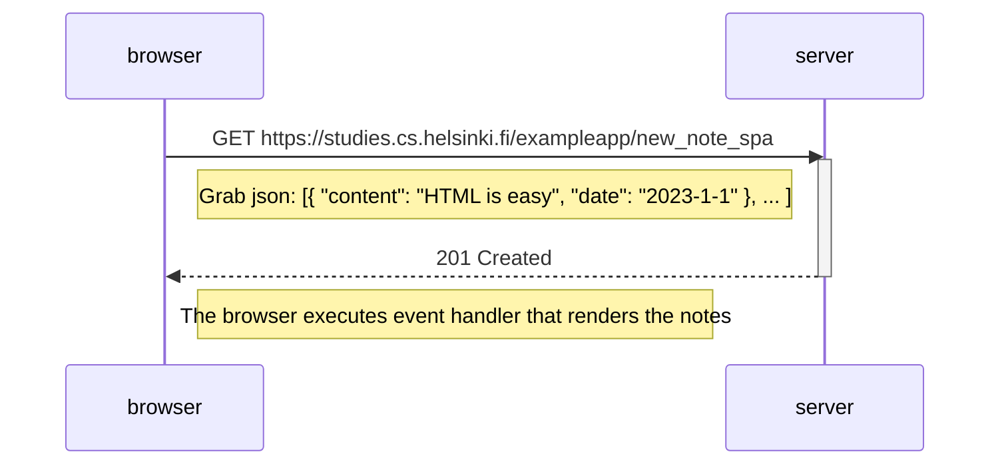

```mermaid
sequenceDiagram
participant browser
participant server

    browser->>server: GET https://studies.cs.helsinki.fi/exampleapp/new_note_spa
    activate server

    Note right of browser: Grab json: [{ "content": "HTML is easy", "date": "2023-1-1" }, ... ]

    server-->>browser: 201 Created
    deactivate server

    Note right of browser: The browser executes event handler that renders the notes
```
